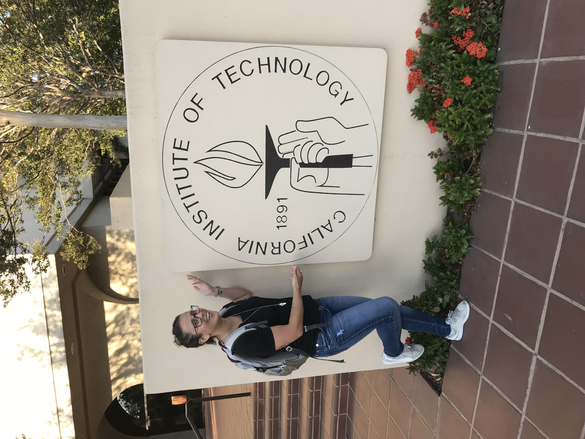
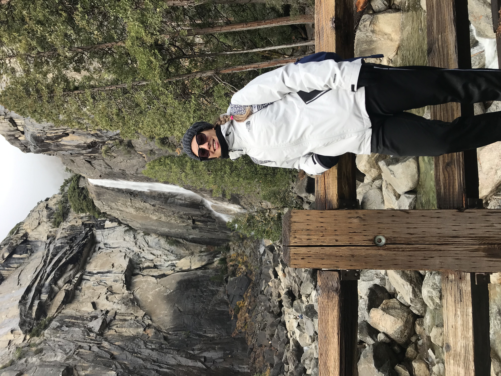
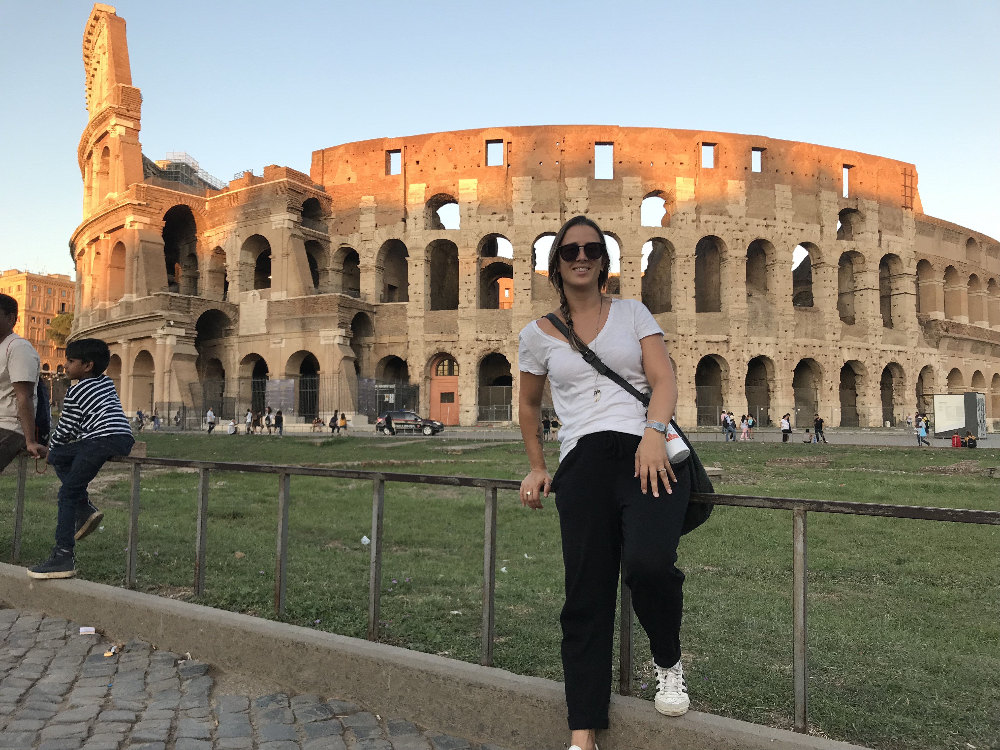
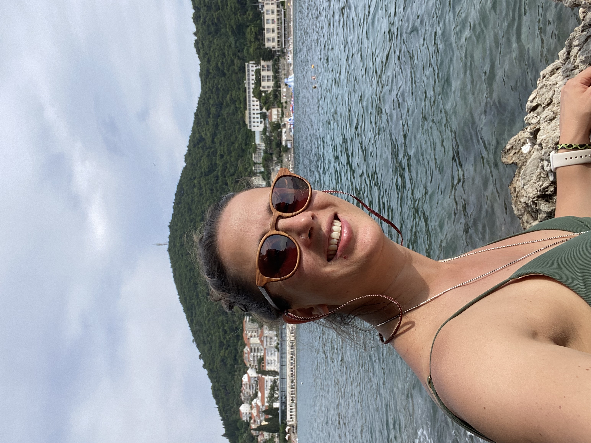

[Home](./index.md) | [About Me](./about.md) | [Publications](./Publications.md) | [Contact](./contact.md) | [Projects](./projects.md) | [Blog](./blog.md)

# About Me

Hi, I’m Camila Areias, and I’m from Brazil 🇧🇷, specifically from a small town nestled in the mountains of Rio de Janeiro. I’m passionate about staying active, whether it’s running, working out, or exploring new restaurants with my partner.

My journey has been an exciting one. From a young age, I’ve been involved in sports, which gave me the opportunity to travel extensively 🌎. This sparked my love for exploring the world. Through my career in science, I’ve had the chance to live and work in Geneva, Zurich, California, and Amsterdam. I’ve also attended conferences in incredible cities like Rome, Dubrovnik, Paris, San Francisco, and Barcelona 🚀.

  

    
  

  

    
  

  

    
  

  

    
  

