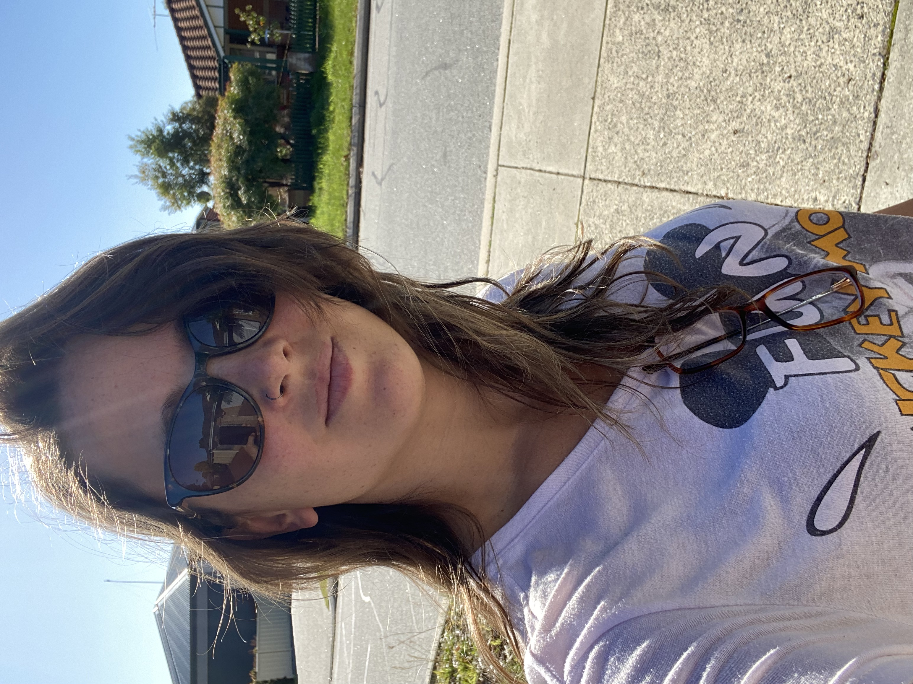

[Home](./index.md) | [About Me](./about.md) | [Publications](./Publications.md) | [Contact](./contact.md)| [Projects](./projects.md) | [Blog](./blog.md)

# SUMMARY

Hello!
My name is Camila, and I am a dynamic and results-oriented researcher with a Ph.D. in Geoscience, specializing in Environmental Geochemistry. Proficient in analytical tools (XRD, SEM, ICP-OES, XRF) and data analysis (R software). I bring extensive expertise in project management, fieldwork planning, and scientific communication. Passionate about sustainability, I am committed to driving sustainable impact and climate resilience to make a positive difference in the world.

  

## EDUCATION

**2020 - PhD degree in Geoscience (Environmental Geochemistry)**
Universidade Federal Fluminense -
(Niterói, Brazil)

**2016 - Master's degree in Geoscience (Geology)**
Universidade Federal do Rio de Janeiro -
(Rio de Janeiro, Brazil)

**2012 - Bachelor's degree in Biology**
Universidade Federal Fluminense -
(Niterói, Brazil)

## Experience

**2020 - 2024 - Postdoctoral Researcher** - 
Vrije Universiteit Amsterdam (Amsterdam, Netherlands):
Conducted experimental research to refine the understanding of carbonate systems.

**2016 - 2020 - PhD Researcher** -
Universidade Federal Fluminense (Niterói, Brazil):
Developed research contributing to a deeper understanding of complex geological and climatic dynamics.

**2014 - 2016 - Junior Project Manager** -
Secretary of the Environment of Rio de Janeiro State (Rio de Janeiro, Brazil):
Oversees and regulate environmental policies and initiatives within the state of Rio de Janeiro.

## Skills 

**Analytical Tools**: XRD, SEM, ICP-OES, XRF

**Data Analysis**: R software

**Fieldwork Planning and Management**
